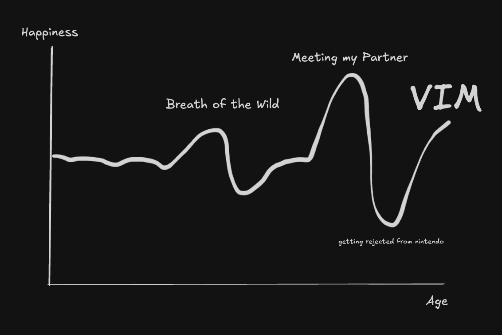

To be completely honest, I never really enjoyed coding. I mean, who does? You spend endless hours locked to a screen,
solving (mostly) menial problems and deal with the frustation of painful bugs day after day after day. Yes, problem-solving
is fun, building things is even more fun, but the road to get there is often not trivial. And by golly, I've gotten pretty 
tired of it all.

# A Brief History (of me)
---

To get a better understanding of what coding means to me, I think it's best to start at the very beginning.
There are four notable turning points in my life (as of writing this article).



Now I hear you say. Alex, how can a 30+ year old text editor even equate to those things? Is it because it frees
you from the suffocating confines of a mouse? Or its numerous keybinds that make you feel _blazingly fast_?

It's because Vim did something I once thought was impossible. 

It made coding fun again.


# Coding is not fun (really)
---
Let me get this straight. I never enjoyed the **act** of coding. I enjoyed the **output**. Seeing someone play
the game I toiled at for weeks, watching developers shave minutes off their workflows from a tool I built.
These are all moments that make me feel vindicated for the pain I suffered through.


> It was about the destination, not the journey

At least, that's what I told myself each and every day.

_That was until... I learned Vim._

# What is Vim?
---
Vim is a glorified text editor with keybinds you can intuitively chain together to make powerful combinations.
Before Vim, there was Vi (Visual Interface). Vim is simply Vi, IMproved. 

As a disclaimer, I use Neovim (nvim). 
When I talk about "using Vim", I mainly talk about using nvim, but you can interpret this as using Vim motions in whatever editor of your choice.
Vim mode is generally available on all major IDEs.

To keep things brief, I will only delve into Vim motions, but the act of using Vim itself extends further beyond that.

# Why use Vim?
------------------------

### The Keyboard is Faster
- If you are able-bodied with two hands, the keyboard is always faster for text-based operations.
- Example 1: CTRL+C, CTRL+V for copy pasting instead of right click menu
- Example 2: F12 to go-to-definition instead of scroll click
- Anything your mouse can do, Vim can do better.

<!--pause-->

### Operation Chaining
- Everything in Vim is made to be chained together like natural language.
- `d2w` = delete two words
- `cib` = change in bracket
- `vf.` = visual (select) until find a `.`
- The possibilities are endless!

<!--pause-->

### It's Cool
Real things people have said to me since using Vim (nvim)
- _"Holy shit, how did you do that?!"_
- _"That's a dope editor"_
- _"Touch some grass, you nerd"_

### An Example - Changing Text in a Bracket

This is something that we as programmers do on a daily basis. Whether it's changing function parameters, text, markdown links, etc. Brackets are a part of our life.

```typescript
obfuscate_text("A super secret password!", Encryption.CAESAR)
```

Let's say you want to change the arguments to this function. Without Vim, this is what you'd probably do:
1. Shift your hand from the keyboard the mouse / trackpad
2. Highlight the text
3. Replace / Delete

To replicate this behaviour in Vim, you can do: 1. Press `v` to enter visual mode 2. Highlight with motions like `hjkl` (move) or `w` (start of word) or `e` (end of word)
3. Press `c` to change

Or, chain commands together and skip steps entirely
`cib` => change in bracket

```typescript
obfuscate_text()
```

What if you just wanted to change the text? Easy. `ci"` => change in quotes `"`
```typescript
obfuscate_text("", Encryption.CAESAR)
```

> Want a quick intro? Do :VimTutor

# Finally, I can get to my point.
---
### It's not about Vim

It never was.

I didn't find coding fun all of a sudden just because of a 30 year old text editor.
I already enjoyed coding, I had just become tired of it, day-in and day-out.
I was burnt out, and I needed something to remind me why I liked coding in the first place.


### It's about Learning

It's crunching through text with Vim,

Surgically manipulating branches and commits with jj,

Visualising graph problems in matplotlib,

Optimising renders with rxjs,

It's feeling of doing something you couldn't before that makes your workflow that much better.
That's the feeling we chase constantly as software developers. We do this, not because it is easy,
but because it is hard.

### So if you felt the same as me...

Learn the language that's piqued your interest for the longest time,

Play around with a new editor (nvim pls) and change things up a bit

Coding is all we do, so we might as well have some fun doing it.
